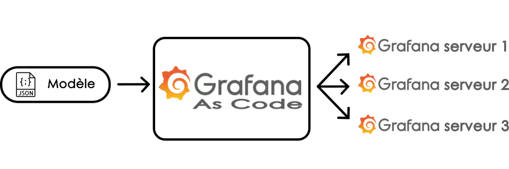
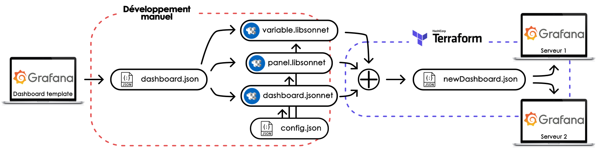

# Grafana As Code

## Sommaire

1. [Objectif](#objectif)
2. [Fonctionnement général](#fonctionnement-général)
3. [Initialisation du projet](#initialisation-du-projet)
4. [Déploiement](#déploiement)
5. [Configuration les fichiers](#configurations)
	1. [Edition des fichiers de configurations](#editer-les-fichiers-de-configurations)
	2. [Token Grafana v9](#récupérer-un-token-grafana-pour-auth-dans-grafana-v9)
	3. [Token Grafana v11](#récupérer-un-token-grafana-pour-auth-dans-grafana-v11)
	4. [UID de datasource](#récupérer-luid-dune-datasource)
6. [Configuration Terraform](#configurer-terraform)
	1. [Nouveau Dashboard modèle](#ajouter-un-nouveau-dashboard-modèle)
	2. [Nouveau provider et Dashboard](#ajouter-un-nouveau-provider-et-un-dashboard)
	3. [Suppression provider](#retirer-un-provider)
7. [Organisation des fichiers](#organisation-des-fichiers)
8. [Débogage](#débogage)
9. [Glossaire](#glossaire)
10. [Sources](#sources-du-projet)


## Objectif

Provisionner les mises à jours d'un tableau de bord modèle vers pusieurs serveurs.



## Fonctionnement général

L'outil est composé de 2 parties distinctes :

* Développement manuel : étape de traduction manuelle du Dashboard JSON en Dashboard Jsonnet et ses bibliothèques libsonnet. Edition des fichiers de configuration ajout des variables dans le Dashboard,

* Déploiement automatique par Terraform : une fois configuré, Terraform génère chaque Dashboard en fonction des configurations choisies et les provisionne dans les différentes instances de Grafana.



## Initialisation du projet

**Installer Terraform** : https://developer.hashicorp.com/terraform/tutorials/aws-get-started/install-cli

**Télécharger golang** : 
* En local https://go.dev/dl/
* Sur serveur Linux distant `wget https://go.dev/dl/go1.24.3.linux-amd64.tar.gz`

**Installer golang** : https://go.dev/doc/install

Ajouter `PATH=$PATH:~/go/bin:/usr/local/go/bin` au fichier `~/.profile` ou directement taper la commande `export PATH=$PATH:/usr/local/go/bin` dans un terminal. Si `go version` ne fonctionne pas, redémarrer la session.

**Installer jsonnet et jsonnet-bundler :**

```bash
go install github.com/google/go-jsonnet/cmd/jsonnet@latest
go install -a github.com/jsonnet-bundler/jsonnet-bundler/cmd/jb@latest
```

**Installer Grafonnet** dans le dossier du projet avec jsonnet-bundler :

```bash
jb install github.com/grafana/grafonnet/gen/grafonnet-latest@main
```

## Déploiement

* Aller dans le répertoire `grafana-as-code`,
* Ajouter un provider :
	* Méthode simple (non recommendée, non compatible avec GitHub) : 
	dans main.tf, ajouter simplement les providers et leurs configurations
	``` hcl
	provider "grafana" {
		alias = "provider1"
		url = "http://provider1.univ-lorawan.fr:3000/"
		auth = "glsa_2d3..."
	}
	```
	* Méthode propre (recommendée) :
	créer à la source du projet le fichier `config_provider.json` avec les données pour chaque provider :
	``` json
	{
		"config_provider1": {
			"url": "http://provider1.univ-lorawan.fr:3000/",
			"auth": "glsa_2d3..."
		},
		"config_provider2": {
			"url":  "https://iot.provider2.fr",
			"auth": "glsa_hQ2..."
		}
	}
	```
	Dans `main.tf`, ajouter si besoin les variables locales associées aux providers :
	``` hcl
	locals {
		...
		config_provider1 = jsondecode(file("config_provider.json"))["config_provider1"]
		config_provider2 = jsondecode(file("config_provider.json"))["config_provider2"]
	}
	```
	Enfin, ajouter si besoin un nouveau provider
	``` hcl
	provider "grafana" {
		alias = "provider1"
		url = local.config_provider1.url
		auth = local.config_provider1.auth
	}
	```
	Par défaut, il faut ajouter le fichier de configuration `config_provider.json` avec les providers `config_provider1` et `config_provider2` et donc utiliser la méthode "propre".
* Configurer les fichiers de configuration `config_xxx.json`.

Enfin :
```bash
terraform init
terraform plan
terraform apply // ou terraform apply -target=grafana_dashboard.myNewDashboard_provider1 pour un dashboard spécifique
```

Terraform s'occupe de générer le dashboard à partir du fichier jsonnet et le pousse automatiquement sur Grafana.

Pour générer manuellement un dashboard au format JSON, aller dans les fichier dashboard jsonnet et les bibliothèques variables et panels libsonnet pour décommenter les variables locales *fullConfig* et *config*, et commenter la variables locale *config* qui suit, puis aller dans le dossier `dashboards` et taper la commande suivante, à adapter avec le dashboard souhaité :
``` bash
jsonnet -J ..\vendor\ .\temp_hum_dashboard.jsonnet -o .\rawDashboard\temp_hum_dashboard.json
```

## Configuration des fichier de configurations

### Editer les fichiers de configurations

Fichier de configuration `config_xxx.json` :
```json
{
	"provider1" :{
		"dashboardName": "Generated Dashboard",
		"bucket": "myBucket",
		"measurements": [
			{ "key": "Temperature", "value": "TempC_SHT", "unit": "celsius" },
			{ "key": "Humidity", "value": "Hum_SHT", "unit": "percent" },
			{ "key": "Air Quality", "value": "Co2_SHT", "unit": "ppm" }
		],
		"variable1Name": "CAMPUS",
		"variable2Name": "Batiment",
		"variable3Name": "ROOM",
		"datasource": "deivf3...TO_BE_MODIFIED"
	},
	"provider2" : {
		...
	}
}

```
Fichier de configuration `config_provider.json`
``` json
{
  "config_provider1": {
    "url": "http://provider1.univ-lorawan.fr:3000/",
    "auth": "glsa_2d3..."
  },
  "config_provider2": {
    "url":  "https://iot.provider2.fr",
    "auth": "glsa_hQ2..."
  }
}
```

> /!\ Pas de "," à la fin de chaque objet !

### Récupérer un token Grafana pour `auth` dans Grafana v9

`Grafana > Configuration` puis au choix :
* API Keys > New API key > Role: Editor > Add > Copy
* Service accounts > Add service account > Role: Admin > Add service account token > Copy clipboard

### Récupérer un token Grafana pour `auth` dans Grafana v11

* `Grafana > Administration > Users and access > Service account > Add service account`
* Role: Admin
* `Create > Add service account token > Generate token > Copy to clipboard`

### Récupérer l'uid d'une datasource

A associer avec la clé `datasource` :
``` bash
curl -u username:password http://url/to/grafana/api/datasources
```

Ou aller dans un dashboard qui utilise déjà la bonne datasource, puis `Share > Export > View JSON` puis chercher l'objet suivant afin de récupérer le bon **uid** :
``` json
"datasource": {
	"type": "influxdb",
	"uid": "deivf3q0qa1hca"
}
```

Les datasources sont visibles ici :
* Grafana v9 : `Grafana > Configurations > Data sources > myDatasource`
* Grafana v11 : `Grafana > Connections > Data sources > myDatasource`

> Le token est déjà associé à une organisation, username et password. Attention à bien créer ce token depuis la bonne organisation.

## Configuration de Terraform

### Ajouter un nouveau dashboard modèle

Toute la documentation pour le bloc data jsonnet_file est disponible ici : https://registry.terraform.io/providers/alxrem/jsonnet/latest/docs/data-sources/file#tla_code-1

* Ajouter le dashboard template .jsonnet dans le dossier `dashboards` et eventuellement ses bibliothèques dans les dossiers `variables` et `panels`
```
myNewDashboard_dashboard.jsonnet
```
* Créer un fichier de configuration propre au dashboard à la source
```
config_myNewDashboard.json
```
Trié par provider
``` json
{
  "provider1": {
    "config1": "...",
    "config2": "...",
    ...
  },
  "provider2": {
    "config1": "...",
    "config2": "...",
    ...
  }
}
```
* Dans le fichier `main.tf`, ajouter une variable de configuration dans le bloc *locals*
``` hcl
config_myNewDashboard = jsondecode(file("config_myNewDashboard.json"))
```
* Et ajouter un bloc data spécifique pour le provider
``` hcl
data "jsonnet_file" "myNewDashboard_dashboard_provider1" {
    source = "${path.module}/dashboards/myNewDashboard_dashboard.jsonnet"
    ext_code = {
      myNewDashboard_dashboard_config = jsonencode(local.config_myNewDashboard.provider1)
    }
}
```
* Ajouter la configuration dans les fichiers sources
```
local config = std.extVar('air_quality_dashboard_config');
```

### Ajouter un nouveau provider et un dashboard

Toute la documentation sur le bloc resource : https://developer.hashicorp.com/terraform/language/resources/syntax

Toute la documentation sur le bloc resource grafana_dashboard : https://registry.terraform.io/providers/grafana/grafana/latest/docs/resources/dashboard

Une fois un dashboard modèle ajouté, il s'agit maintenant de le pousser au bon endroit, sur la bonne instance de Grafana (ou provider).

* Pour des raisons de sécurité sur GitHub, il n'est pas possible de directement stocker des tokens. Dans le cas général, créer à la source du projet le fichier `config_provider.json` qui contient :
``` json
{
  "config_provider1": {
    "url": "http://provider1.univ-lorawan.fr:3000/",
    "auth": "glsa_2d3..."
  },
  "config_provider2": {
    "url":  "https://iot.provider2.fr",
    "auth": "glsa_hQ2..."
  }
}
```
Pour une méthode plus simple et directe (non recommendée), passer directement aux derniers points.

	* Dans `main.tf`, ajouter les variables locales associées aux providers :
``` hcl
locals {
	...
	config_provider1 = jsondecode(file("config_provider.json"))["config_provider1"]
  config_provider2 = jsondecode(file("config_provider.json"))["config_provider2"]
}
```

	* Ajouter un nouveau provider
``` hcl
provider "grafana" {
  alias = "provider1"
  url = local.config_provider1.url
  auth = local.config_provider1.auth
}
```

Dans le cas plus simple, rentrer directement url et auth entre guillemets.
	* Ajouter le nouveau provider dans le fichier de configuration du dashboard

	* S'assurer d'avoir un bloc data en lien avec le provider (voir section ci dessus)

* Ajouter un nouveau bloc ressource. C'est un objet de l'infrastructure qui va permettre de créer le dashboard en format JSON et le pousser sur l'instance Grafana
```
resource "grafana_dashboard" "myNewDashboard_provider1" {
  provider    = grafana.provider1
  config_json = data.jsonnet_file.myNewDashboard_dashboard_provider1.rendered
}
```

### Retirer un provider

Retirer les configurations d'un provider dans `main.tf` ne suffit pas à le retirer complètement. Il reste toutes les ressources associées à ce provider et dont terraform garde les configurations en mémoire. L'erreur produite après un `terraform plan` ou `terraform apply` ressemble à :

``` bash
│ Error: Provider configuration not present
│
To work with grafana_dashboard.temp_hum_provider1 (orphan) its original provider configuration at provider["registry.terraform.io/grafana/grafana"].provider1 is required, but it has been removed. This occurs when a provider configuration is removed while objects created by that provider still exist in the state. Re-add the provider configuration to destroy grafana_dashboard.temp_hum_provider1 (orphan), after which you can remove the provider configuration again.
```

Rafraichir ou supprimer le cache ne suffit pas. Il faut donc retirer les ressources manuellement.

Lister l'état des ressources stockées par terraform
``` bash
terraform state list
> grafana_dashboard.temp_hum_provider1
> grafana_dashboard.temp_hum_dev
```

Supprimer la ou les ressources.
``` bash
terraform state rm grafana_dashboard.temp_hum_provider1
```

Une méthode alternative est de supprimer le fichier `terraform.tfstate`.

## Organisation des fichiers

```
.
├── README.md
├── main.tf
├── config_air_quality.json
├── config_temp_hum.json
├── config_provider.json
├── dashboards
│   ├── air_quality_dashboard.jsonnet
│   ├── temp_hum_dashboard.jsonnet
│   ├── panels
│   │   ├── panel_air_quality.libsonnet
│   │   └── panel_temp_hum.libsonnet
│   └── variables
│       ├── variable_air_quality.libsonnet
│       └── variable_temp_hum.libsonnet
├── jsonnetfile.json
├── jsonnetfile.lock.json
├── terraform.tfstate
├── images ...
└── vendor ...
```

Toutes les informations utiles au dashboard sont dans le répertoire `dashboards`. Les fichiers `xxx_dashboard.jsonnet` regroupent toutes les configurations relatives au dashboards générés. Les paneaux et les variables sont respectivement stockées dans les bibliothèques libsonnet de `panels` et `variables` : on peut retrouver tous les détails mais aussi les éléments de génération adaptés à la configuration choisie par l'utilisateur.

L'utilisateur n'a que les fichiers de configuration à modifier dans lequel il décrit toutes les configurations souhaitées : `config_provider.json` et `config_xxx.json`.

## Débogage

``` bash
debian@user:IoT-main/dashboards$ jsonnet -J vendor bikeGarage.jsonnet
RUNTIME ERROR: couldn't open import "github.com/grafana/grafonnet/gen/grafonnet-latest/main.libsonnet": no match locally or in the Jsonnet library paths
        bikeGarage.jsonnet:1:19-92      thunk <grafonnet> from <$>
        bikeGarage.jsonnet:3:1-10
        During evaluation
```

Revenir dans le dossier du projet jsonnet qui contient le fichier `vendor` puis faire `jsonnet -J vendor dashboards/bikeGarage.jsonnet`.

``` bash
Error: Error in function call
│
│   on main.tf line 16, in locals:
│   16:   config = jsondecode(file("config.json"))
│     ├────────────────
│     │ while calling jsondecode(str)
│
│ Call to function "jsondecode" failed: invalid character '}' looking for beginning of object key string.
```

Retirer la dernière virgule "," à la fin de l'objet du fichier json.

## Glossaire
[**Terraform**](https://fr.wikipedia.org/wiki/Terraform_(logiciel)) : environnement logiciel d'« infrastructure as code » publié par la société HashiCorp. Cet outil permet d'automatiser la construction des ressources d'une infrastructure de centre de données comme un réseau, des machines virtuelles, un groupe de sécurité ou une base de données.

**HCL** : Hashicorp Configuration Language, language utilisé par Terraform

**provider** : objet de l'infrastructure Terraform qui représente une instance de destination (par exemple une instance de Grafana)

**data** : objet de l'infrastructure Terraform qui représente les données sources (par exemple un dashboard template stocké en tant que fichier jsonnet)

**resource** : objet de l'infrastructure Terraform qui va permettre de créer le dashboard en format JSON et le pousser sur un provider 

**jsonnet** : langage de création de modèle de données permettant de générer des fichier JSON. C'est une extension du language JSON

**grafonnet** : bibliothèque jsonnet dédiée à la génération de dashboard pour Grafana

## Sources du projet

**What is Grafana As Code?** https://grafana.com/blog/2020/02/26/how-to-configure-grafana-as-code/ 

**Convertir lignes de code en string** https://www.freeformatter.com/json-escape.html#before-output

**Documentation Terraform pour Grafana** https://registry.terraform.io/providers/grafana/grafana/latest/docs

**Documentation Terraform** https://developer.hashicorp.com/terraform/language

**Provider grafana** https://developer.hashicorp.com/terraform/language

**Data jsonnet** https://registry.terraform.io/providers/alxrem/jsonnet/latest/docs/data-sources/file#tla_code-1

**Synthaxe jsonnet** https://jsonnet.org/learning/tutorial.html

**Packages grafonnet** https://github.com/grafana/grafonnet/tree/d20e609202733790caf5b554c9945d049f243ae3/gen/grafonnet-v11.4.0
